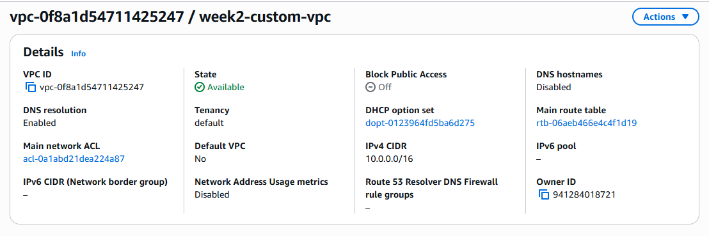
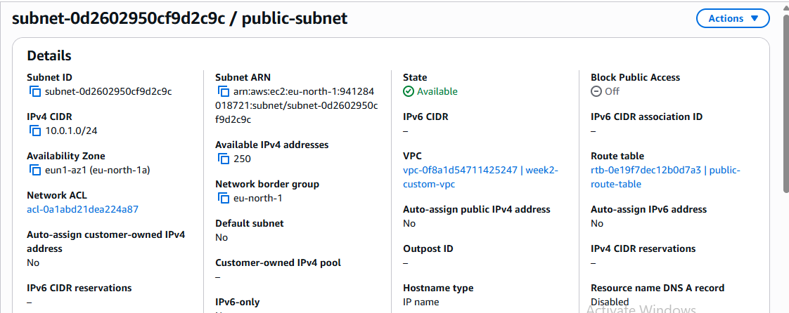
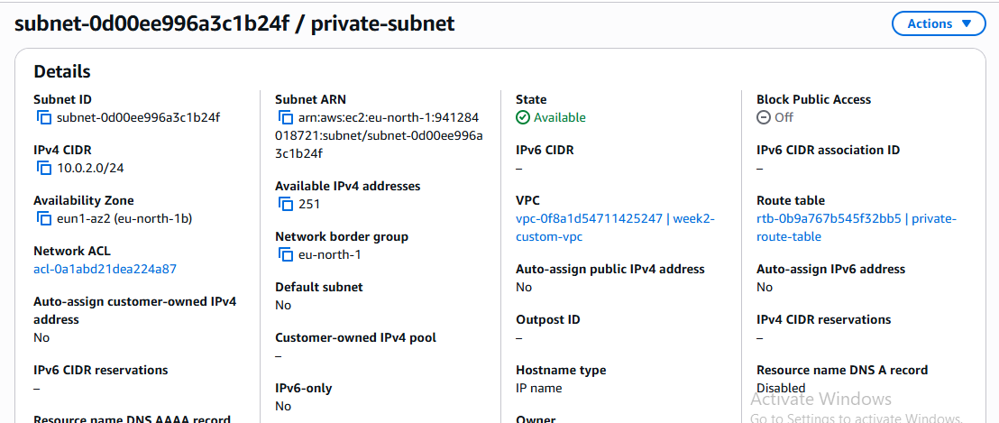
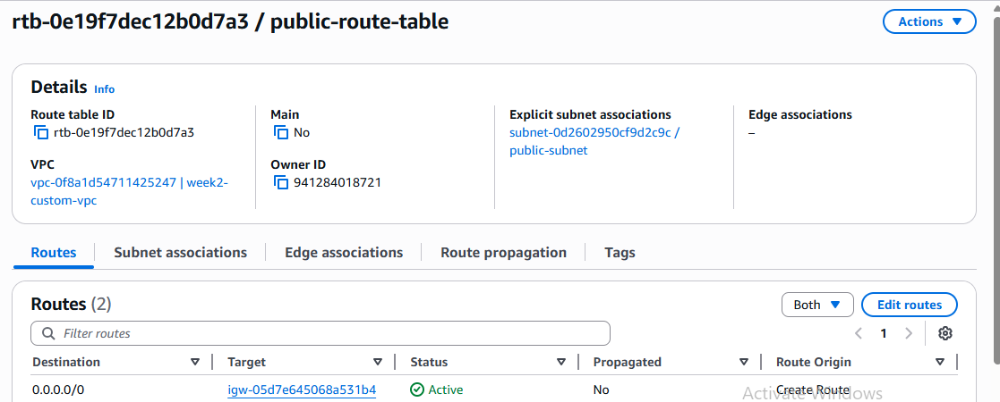
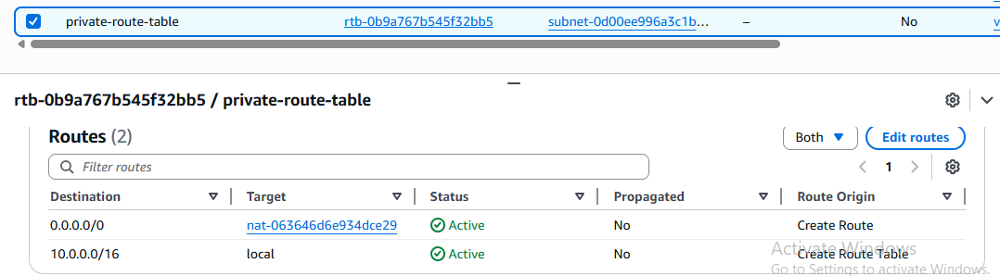
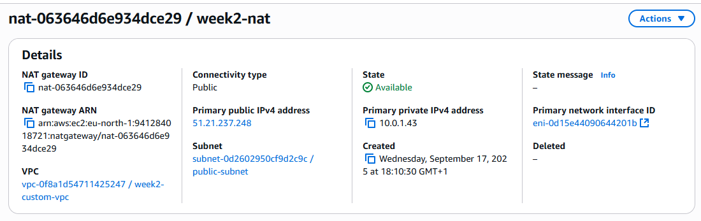
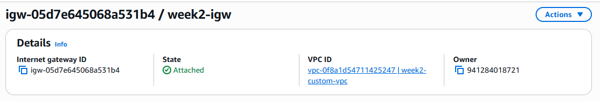

# week2-cloud-vpc-subnets
Custom VPC setup with public/private subnets, route tables, and IGW &amp; NAT Gateway

## 🔧 What I Did
- Created custom VPC
- Designed public/private subnets
- Configured route tables
- Set up NAT Gateway
- Verified EC2 connectivity

## 📸 Screenshots
### VPC Creation

### Public Subnet

### Private Subnet

### Route Table (Public)
This route table is associated with my public subnet and includes a route to the Internet Gateway, enabling outbound internet access.

### Route Table (Private)
This route table is associated with my private subnet and includes a route to the NAT Gateway, allowing outbound internet access without exposing the subnet directly.

### NAT Gateway
This NAT Gateway is deployed in a public subnet and enables instances in the private subnet to access the internet securely.

### Internet Gateway
This Internet Gateway is attached to the VPC and enables internet access for resources in the public subnet.

